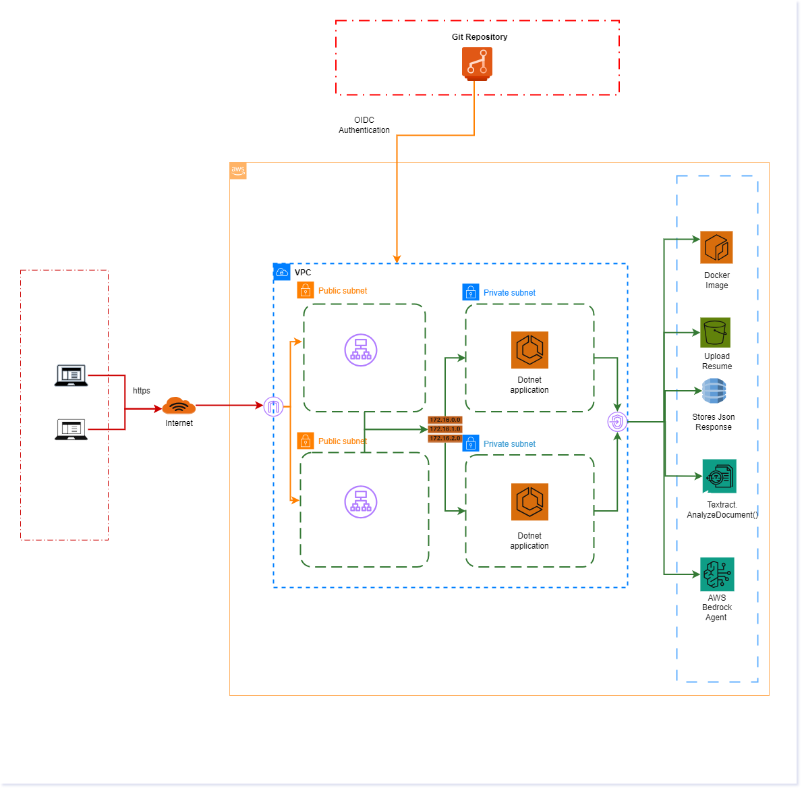

# ReRhythm 🎯
> AI-powered 28-day career coaching platform that analyzes your resume and generates a personalized learning roadmap to land your target role.

---

## 🚀 What It Does

1. **Upload your resume** → AWS Textract parses and extracts your skills
2. **Enter your target role** → Claude Sonnet 4.5 analyzes skill gaps
3. **Get a 28-day roadmap** → Personalized weekly modules with daily 15-minute sprints
4. **Get a professional resume** → AI-generated resume tailored to your target role
5. **Track your progress** → Milestones, portfolio projects, and interview prep

---

## 🏗️ Architecture

